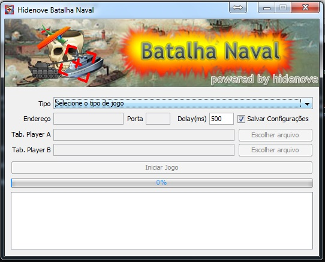
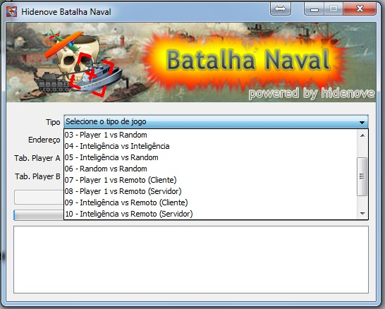
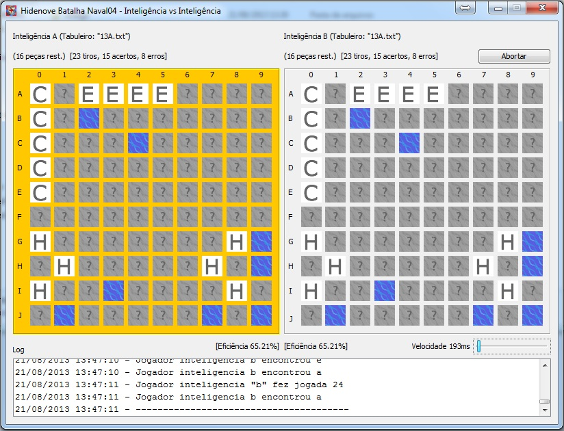
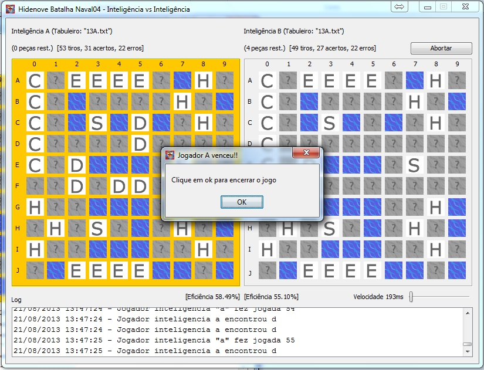

batalhanaval
============

Trabalho elaborado na disciplina de Sistemas Distribuidos no curso de Ciência da Computação da Universidade de Itaúna.

O objetivo do trabalho foi a construção de um jogo que funcionasse em rede onde dois algoritmos dotados de certa inteligência se combateriam afim de vencer o jogo, no caso o jogo escolhido foi o de batalha naval, onde foi construida uma interface gráfica amigável e meios onde é possível jogar nos modos abaixo bem como a permutação deles:

Humano x Humano
Humano x Inteligencia
Humano x Random
Humano x Outra maquina na rede (Humano, inteligencia, random)

Foi utilizado a linguagem Java 6.

Screenshots do game podem ser encontrados abaixo:

